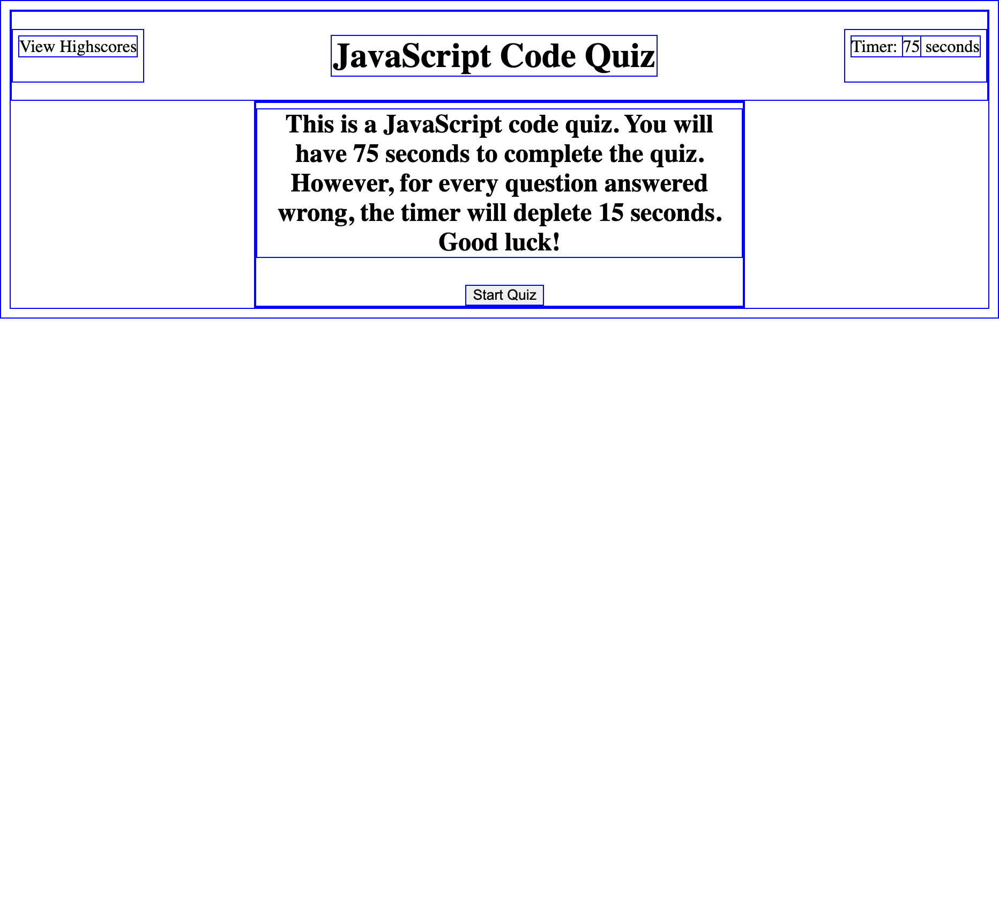

# web-api-code-quiz

## Description

- The purpose of this this challenge was to create a JavaScript mini quiz. Unfortunately, this was the hardest challenge for me so I was not able to make it look more fancy. Regardless, I was able to get the basics done and I learned that I definitely need more tutoring and guidance and practice to be able to at least master some basic concepts. I really hope to get better eventually and that it may reflect in my future projects!

## Installation

N/A

## Usage
The way to use this site is fairly straight-foward. You are to take a quiz and at the end of the quiz there is an option to submit your score. This should reflect automatically under highscores!

  GitHub page: https://noe-bee.github.io/web-api-code-quiz/
    
  GitHub repository: https://github.com/noe-bee/web-api-code-quiz

 

## Credits
-thanks so much to my tutor for helping me understand javaScript a little bit better with his explanations!

## License

Refer to the license on the repository.

---
